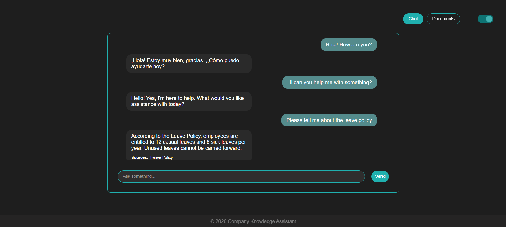
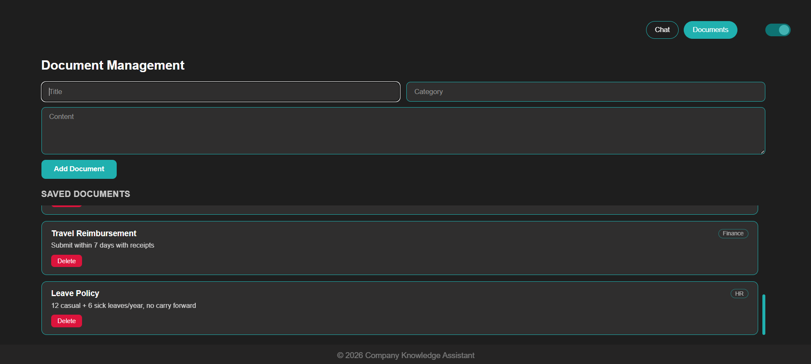

# Company Knowledge Assistant

A full-stack **Retrieval-Augmented Generation (RAG)** chatbot that lets you ingest internal company documents and query them conversationally. Built with a React frontend, Flask backend, MongoDB for document storage, Qdrant for vector search, and Google Gemini for both embeddings and answer generation.

---

## 🎥 Website Walkthrough
 
Check out the [demo video](https://www.loom.com/share/65868e2f77124efba7e999d20f3f0290) - best watched at **1.5x speed**.

---

## Sneak-Peek

### Chat Page

 
### Documents Page



---

## Features

- **Document Ingestion** - Add company documents with a title and category
- **Conversational Chat** - Ask questions and get answers grounded in your documents
- **Semantic Search** - Uses Gemini embeddings + Qdrant vector DB for relevant chunk retrieval
- **Source Attribution** - Responses cite which documents they came from
- **Chat History** - Persisted per-session conversation history via MongoDB
- **Dark/Light Mode** - Theme toggle with local storage persistence
- **Admin Index Rebuild** - Secret-protected endpoint to rebuild the Qdrant vector index from MongoDB, useful when the vector DB cluster is recreated/reset

---

## Architecture

```
┌─────────────────────────────────────────────────────────────────┐
│                        React Frontend                           │
│   ChatPage  ──────────────────────────────  DocumentsPage       │
│   (Ask questions)                          (Ingest, delete)     │
└────────────────────────┬────────────────────────────────────────┘
                         │  HTTP (REST API)
                         ▼
┌─────────────────────────────────────────────────────────────────┐
│                      Flask Backend (backend/app.py)             │
│                                                                 │
│   POST /ask                  →   search_service.ask_question()  │
│   POST /documents            →   ingest_service.ingest_content()│
│   GET  /documents            →   MongoDB fetch                  │
│   DELETE /documents/:id      →   MongoDB + Qdrant delete        │
│   GET  /chat-history/:id     →   MongoDB fetch                  │
│   DELETE /chat-history/:id   →   MongoDB delete                 │
│   POST /admin/rebuild-index  →   rebuild Qdrant from MongoDB    │
└────────┬───────────────────────────┬────────────────────────────┘
         │                           │
         ▼                           ▼
┌─────────────────┐       ┌──────────────────────────────────────┐
│    MongoDB      │       │           Ingest Pipeline            │
│    (Atlas)      │       │                                      │
│                 │       │  chunking.py  →  Gemini Embeddings   │
│  documents      │       │  (chunk_text)  (gemini-embedding-001)│
│  chat_sessions  │       │       │                              │
└─────────────────┘       │       ▼                              │
                          │  qdrant_store.add_chunks()           │
                          └──────────────┬───────────────────────┘
                                         │
                                         ▼
                          ┌──────────────────────────┐
                          │     Qdrant Vector DB     │
                          │  (Cloud - AWS sa-east-1) │
                          │   Collection: rag_docs   │
                          │   Vector size: 3072      │
                          └──────────────┬───────────┘
                                         │
                          ┌──────────────▼────────────┐
                          │      Search Pipeline      │
                          │                           │
                          │      embed(question)      │
                          │             ↓             │
                          │ qdrant_store.search_chunks│
                          │  (top-k=3, score ≥ 0.50)  │
                          │             ↓             │
                          │          Gemini           |
                          |   (gemini-flash-latest)   |
                          |             ↓             |
                          │           JSON            |
                          |  {found, answer, source}  │
                          └───────────────────────────┘
```

### Data Flow - Ask a Question

```
User question
     │
     ▼
Embed with Gemini (gemini-embedding-001)
     │
     ▼
Vector search in Qdrant (top_k=3, threshold=0.50)
     │
     ▼
Fetch last 3 chat turns from MongoDB (session context)
     │
     ▼
Build prompt: [session history] + [retrieved chunks] + [question]
     │
     ▼
Gemini (gemini-flash-latest) → JSON { found, answer, source }
     │
     ▼
Save Q&A to MongoDB chat_sessions
     │
     ▼
Return {answer, sources} to frontend
```

### Data Flow - Ingest a Document

```
{ title, content, category }
     │
     ▼
Store full document in MongoDB (documents collection)
     │
     ▼
chunk_text() - sentence-aware sliding window
  target_words=220, overlap_words=40
  (if total words ≤ single_chunk_threshold=80,
   skip chunking → return as one single chunk)
     │
     ▼
Gemini embed() → embeddings (3072-dim)
     │
     ▼
Qdrant upsert - each chunk as a PointStruct
  payload: {mongo_id, chunk_no, title, text, category}
```

---

## Project Structure

```
RAG_Company_Assistant/
│
├── backend/
│   ├── app.py                    # Flask entry point, all routes
│   ├── config.py                 # Env var loading (Mongo URI, DB name)
│   │
│   ├── services/
│   │   ├── ingest_service.py     # Document ingestion orchestration
│   │   ├── vector_service.py     # Chunk → embed → store pipeline
│   │   └── search_service.py     # RAG query pipeline + Gemini call
│   │
│   ├── ai/
│   │   └── models.py             # Gemini client init + embed()
│   │
│   ├── db/
│   │   └── mongo.py              # MongoDB client + collections
│   │
│   ├── vector/
│   │   ├── qdrant_db.py          # Qdrant client + collection init
│   │   └── qdrant_store.py       # add_chunks, search_chunks, delete, clear
│   │
│   ├── utils/
│   │   └── chunking.py           # Text cleaning + sliding window chunker
│   │
│   └── requirements.txt
│
├── frontend/                     # React app (Vite)
│   └── src/
│       ├── App.jsx
│       └── components/
│           ├── ChatPage.jsx
│           ├── DocumentsPage.jsx
│           └── ThemeToggle.jsx
│
└── .env                          # (not committed)
```

---

## Tech Stack

| Layer          | Technology                                           |
| -------------- | ---------------------------------------------------- |
| Frontend       | React, CSS variables (dark/light theme)              |
| Backend        | Python 3.11+, Flask, flask-cors                      |
| LLM            | Google Gemini `gemini-flash-latest` (`google-genai`) |
| Embeddings     | Google Gemini `gemini-embedding-001` (3072-dim)      |
| Vector DB      | Qdrant Cloud (AWS sa-east-1)                         |
| Document DB    | MongoDB Atlas                                        |
| Env management | `python-dotenv`                                      |

---

## Setup Instructions

### Prerequisites

- Python 3.11+
- Node.js 18+
- A [MongoDB Atlas](https://www.mongodb.com/cloud/atlas) cluster (free tier works)
- A [Qdrant Cloud](https://cloud.qdrant.io/) cluster (free tier works)
- A [Google Gemini API key](https://aistudio.google.com/app/apikey)

---

### 1. Clone the Repository

```
git clone https://github.com/chandreyeeshome/RAG_Company_Assistant.git
cd RAG_Company_Assistant
```

---

### 2. Backend Setup

```
cd backend
python -m venv venv

# Windows (Command Prompt)
venv\Scripts\activate
 
# Windows (PowerShell)
.\venv\Scripts\Activate.ps1

# macOS/Linux
source venv/bin/activate

pip install -r requirements.txt
```

#### Configure environment variables

Create a `.env` file inside `backend/`:

```
MONGO_URI=your_mongodb_atlas_uri
DB_NAME=your_db_name
QDRANT_URL=your_qdrant_cluster_url
QDRANT_API_KEY=your_qdrant_api_key
GEMINI_API_KEY=your_gemini_api_key
ADMIN_SECRET=your_admin_secret_for_rebuild_endpoint
```

#### Qdrant collection

You don't need to create the collection manually - `backend/vector/qdrant_db.py` auto-creates the `rag_docs` collection (3072-dim, COSINE distance) on first run if it doesn't already exist, along with a `mongo_id` payload index.

#### Run the Flask backend

```
python app.py
```

Backend runs at `http://localhost:5000`.

---

### 3. Frontend Setup

```
cd frontend
npm install
npm run dev
```

Frontend runs at `http://localhost:5173`.

Set `VITE_API_URL` in a `frontend/.env` file if your backend isn't running at `http://localhost:5000`.

---

## API Reference

| Method   | Endpoint                      | Description                                                          |
| -------- | ----------------------------- | -------------------------------------------------------------------- |
| `GET`    | `/`                           | Health check                                                         |
| `POST`   | `/documents`                  | Ingest a new document                                                |
| `GET`    | `/documents`                  | List all documents                                                   |
| `DELETE` | `/documents/<doc_id>`         | Delete document (MongoDB + Qdrant)                                   |
| `POST`   | `/ask`                        | Ask a question (RAG pipeline)                                        |
| `GET`    | `/chat-history/<session_id>`  | Get chat history for a session                                       |
| `DELETE` | `/chat-history/<session_id>`  | Clear chat history for a session                                     |
| `POST`   | `/admin/rebuild-index`        | Rebuild Qdrant index from MongoDB (requires `x-admin-secret` header) |

#### POST `/documents`

```json
{
  "title": "Leave Policy 2025",
  "content": "Employees are entitled to 20 days of paid leave...",
  "category": "HR"
}
```

#### POST `/ask`

```json
{
  "question": "How many leave days do employees get?",
  "session_id": "user-abc-123"
}
```

#### Response

```json
{
  "answer": "Employees are entitled to 20 days of paid leave per year.",
  "sources": ["Leave Policy 2025"]
}
```

---

## 🧩 Key Design Decisions

- **Sliding window chunking** - with sentence boundary awareness ensures context isn't split mid-thought. Chunks of ~220 words with 40-word overlap balance retrieval precision and context richness.
- **Score threshold (0.50)** - on Qdrant results filters out low-confidence matches, preventing hallucination from loosely related chunks.
- **Session-aware context** - the last 3 conversation turns are always pulled from MongoDB and prepended to the retrieval prompt; the LLM (not a similarity score) decides whether a question is actually about prior conversation, current documents, or both.
- **Single-chunk handling** - documents under 80 words are stored as one chunk, avoiding meaningless fragmentation.
- **Gemini returns structured JSON** - the prompt enforces `{ found: bool, answer: str, source: "document" | "conversation" | "none" }` output, making parsing deterministic and letting the backend decide what sources to display.
- **Admin rebuild endpoint** - since free-tier Qdrant clusters can be reset/recreated by the admin, `/admin/rebuild-index` re-embeds every MongoDB document into a fresh Qdrant collection without needing to re-ingest from scratch.

---

## 🔭 Scope of Improvements

- **Better UI/UX** - current interface is functional but minimal; polish spacing, empty states, and responsiveness for smaller screens.
- **Status/loading messages** - no visible feedback while a document is being ingested or a question is being answered (e.g. "Embedding document...", "Searching knowledge base...").
- **File-based ingestion** - currently only raw pasted text is supported; add `.pdf`, `.docx`, and `.txt` upload support instead of requiring manual copy-paste.
- **Chat memory window** - only the last 3 conversation turns are fetched for context; this lookback window could be increased (or made configurable) for longer, more coherent multi-turn conversations.
- **Streaming answers** - the frontend currently fakes a typewriter effect after the full answer arrives; true token-level streaming from the backend would feel more responsive.
- **Document editing** - no way to update an existing document's content/category without deleting and re-ingesting it.
- **Authentication** - there's currently no user-level auth; anyone with the URL can ingest, delete, or query documents. The `/admin/rebuild-index` route is the only protected endpoint.
- **Pagination** - `/documents` and `/chat-history` return everything at once; pagination would help as data grows.

---

## Site Link

You can check the RAG Company Assistant here: 
[rag-company-assistant.vercel.app](https://rag-company-assistant.vercel.app)